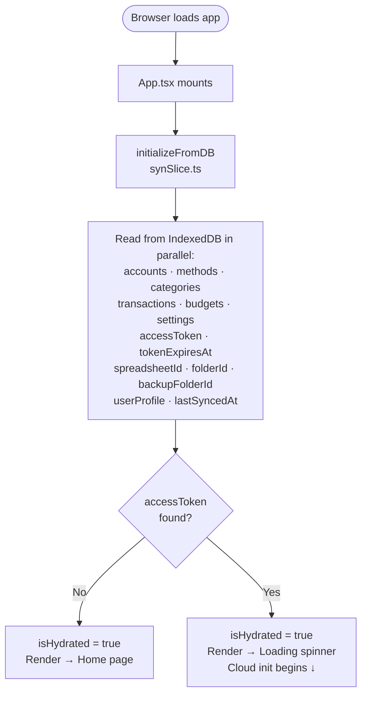
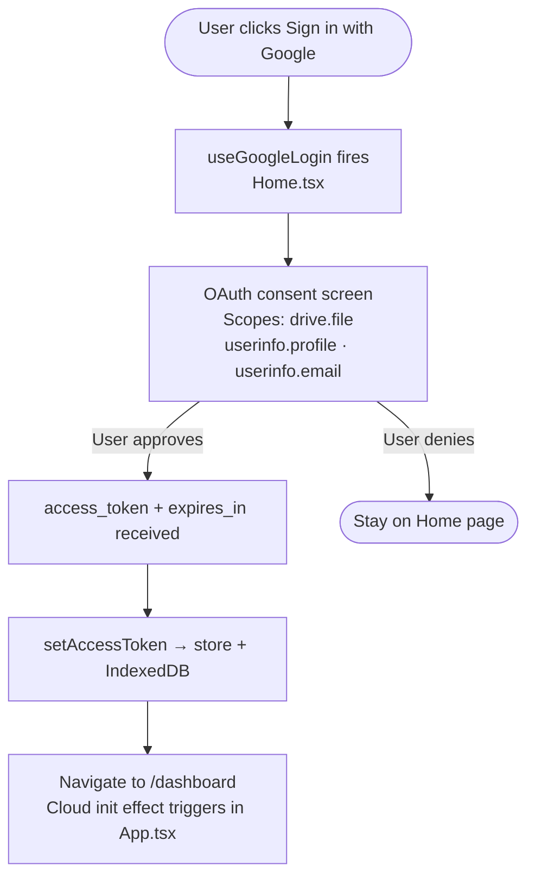
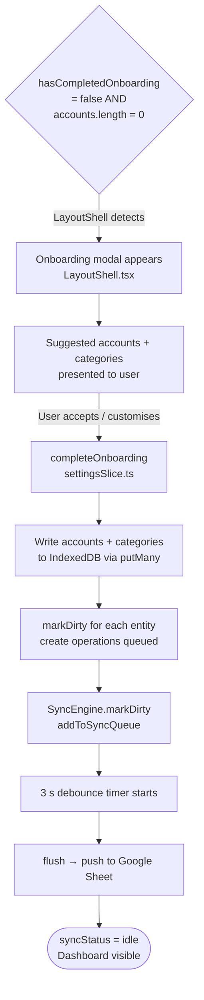
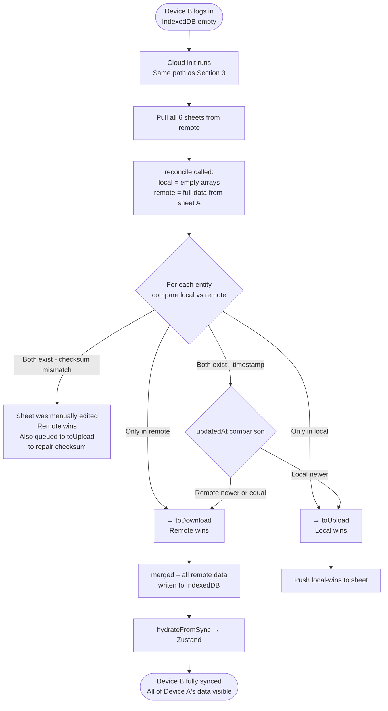
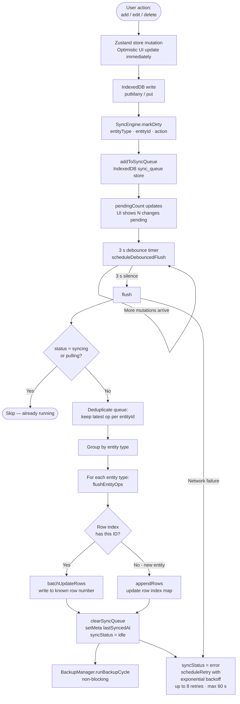
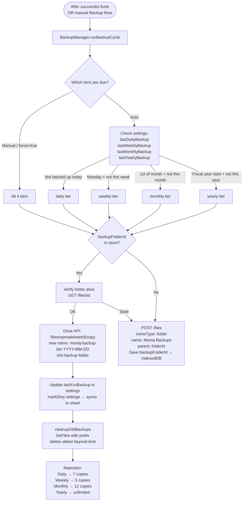
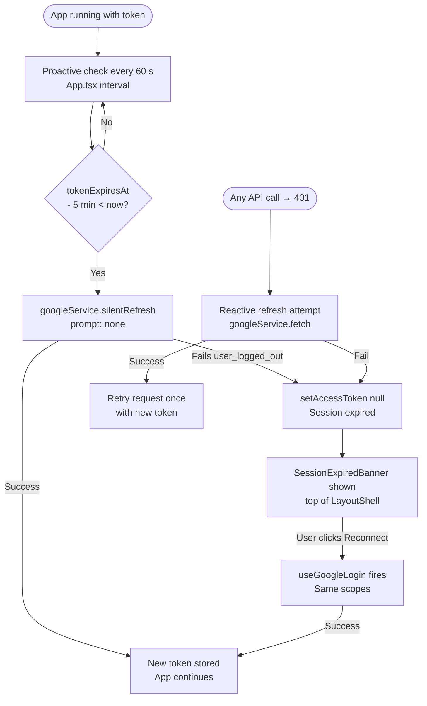
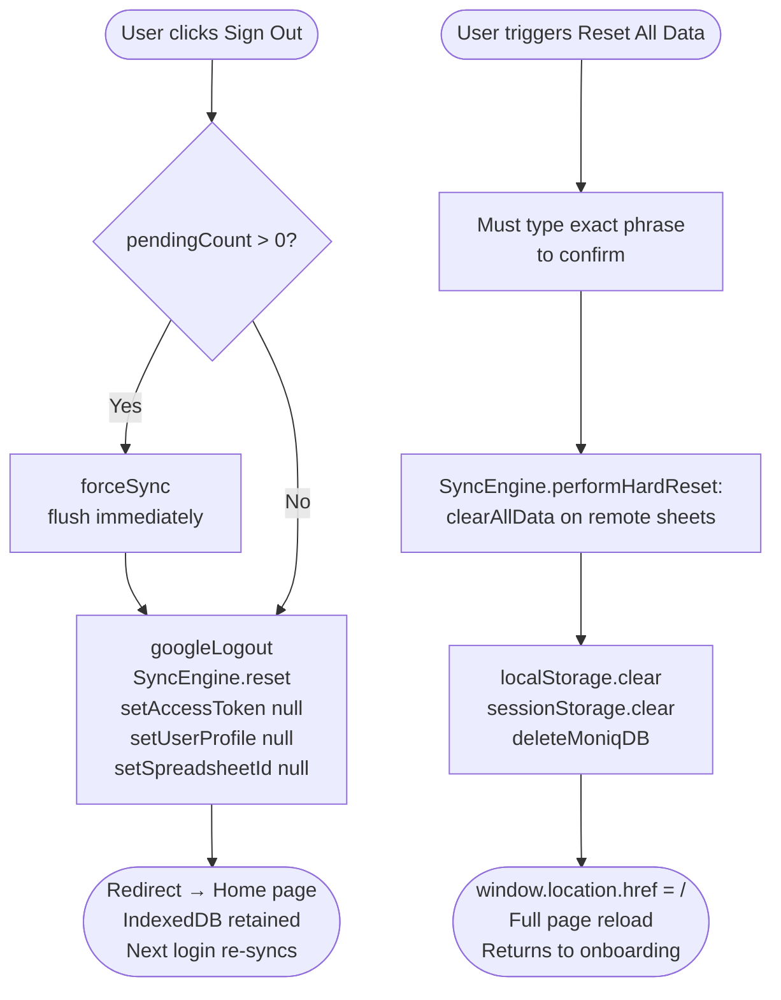

# Moniq — Complete Application Flow

> Mapped directly from source code (App.tsx, api/google.ts, SyncEngine.ts, BackupManager.ts, ConflictResolver.ts, syncSlice.ts).

---

## 1. App Boot & Local Hydration

Every time the app loads, regardless of auth state:



---

## 2. Sign-In Flow



---

## 3. Cloud Initialization — The Central Decision Point

This runs on every login (new device or returning session).

```mermaid
flowchart TD
    START([accessToken + isHydrated = true]) --> P[fetchUserProfile\nDisplay name + avatar]
    P --> INIT[initializeDatabase\napi/google.ts]

    INIT --> FID{folderId\nin IndexedDB?}
    FID -->|Yes| FVERIFY[GET /files/folderId?fields=id,trashed\nVerify still alive]
    FVERIFY -->|OK| SID{spreadsheetId\nin IndexedDB?}
    FVERIFY -->|Trashed / 404| FCREATE
    FID -->|No| FCREATE[POST /files\nmimeType: folder\nname: moniq]
    FCREATE --> FSAVE[Save folderId → IndexedDB]
    FSAVE --> SID

    SID -->|Yes| SVERIFY[GET /files/spreadsheetId?fields=id,trashed\nVerify still alive]
    SVERIFY -->|OK| ENGINE[SyncEngine.initialize spreadsheetId]
    SVERIFY -->|Trashed / 404| SCREATE
    SID -->|No| SCREATE[POST /files\nmimeType: application/vnd.google-apps.spreadsheet\nparents: folderId\nname: Moniq Database]
    SCREATE --> SSAVE[Save spreadsheetId → IndexedDB]
    SSAVE --> ENGINE

    ENGINE --> TABS[ensureSheetTabs\nTransactions · Accounts · Methods\nCategories · Budgets · Settings]
    TABS --> HEADERS[ensureHeaders on each tab\nRepair if column mismatch found]
    HEADERS --> PULL[Read all 6 sheets in parallel\nSheetClient.readSheet ×6]
    PULL --> RECONCILE[reconcile × 5 entity types\nConflictResolver.ts]
    RECONCILE --> MERGE[Merged result → IndexedDB\nputMany × 5 stores]
    MERGE --> PUSH[Push local-wins back to sheet\nbatchUpdateRows / appendRows]
    PUSH --> CLEAR[clearSyncQueue\nsetMeta lastSyncedAt]
    CLEAR --> HYDRATE[hydrateFromSync → Zustand store]
    HYDRATE --> ONBOARD{hasCompletedOnboarding?}
```



---

## 4A. New User — Onboarding Path



---

## 4B. Returning User / Cross-Device Sync

> This is the key multi-device scenario. Device B logs in, sees empty local DB but full remote sheet.



---

## 5. Live Mutation Delta Sync

Every time the user makes a change (add transaction, edit account, etc.):



---

## 6. Backup System

Triggered automatically after every successful flush, and manually from Settings.



---

## 7. Token & Session Management



---

## 8. Logout & Hard Reset



---

## Drive Folder Structure

```
Google Drive (root)
└── moniq/                          ← folderId persisted in IndexedDB
    ├── Moniq Database              ← spreadsheetId persisted in IndexedDB
    │   ├── Transactions tab
    │   ├── Accounts tab
    │   ├── Methods tab
    │   ├── Categories tab
    │   ├── Budgets tab
    │   └── Settings tab
    └── Moniq Backups/              ← backupFolderId persisted in IndexedDB
        ├── moniq-backup-daily-2026-05-18
        ├── moniq-backup-weekly-2026-05-12
        ├── moniq-backup-monthly-2026-05-01
        └── moniq-backup-yearly-2026-01-01
```

> All three IDs (`folderId`, `spreadsheetId`, `backupFolderId`) are stored in IndexedDB `meta` store
> and reloaded on every app start — no Drive search queries are needed.

---

## Gap Analysis & Issues Found

| # | Area | Current Behaviour | Issue / Risk |
|---|---|---|---|
| 1 | **Cross-device: new user on Device B** | If Device B has never logged in, `folderId` and `spreadsheetId` are `null` in its IndexedDB. `initializeDatabase` will create **new** empty folder + sheet instead of finding the existing ones from Device A. | **Critical** — Device B will create a second `moniq` folder. Data from Device A is inaccessible. See fix below ↓ |
| 2 | **Onboarding gate** | `LayoutShell` checks `isCloudInitialized && accounts.length === 0 && !hasCompletedOnboarding`. The onboarding modal fires. | If Device B syncs correctly (gap 1 fixed), accounts won't be zero and modal won't show. If gap 1 is not fixed, it shows incorrectly. |
| 3 | **Settings sheet on new device** | Settings (including `hasCompletedOnboarding`) are only read from the sheet during `initialize()`. If the sheet has them, they come down. | Works correctly once gap 1 is fixed. |
| 4 | **Backup folder nesting** | Backup folder is placed inside `moniq/` root. | Good structure. Matches your expectation. |
| 5 | **Concurrent write race** | Two devices open simultaneously, both flush different changes to same row. | Acknowledged as out of scope — last-write-wins via flush. Acceptable for now. |
| 6 | **Logout does not clear folderId** | `handleLogout` calls `setSpreadsheetId(null)` but not `setFolderId(null)` or `setBackupFolderId(null)`. | Minor — on next login, same device reuses the stored IDs correctly. But it should still be cleared for correctness. |

---

## Gap 1 Fix — Cross-Device Folder Discovery

The `drive.file` scope blocks search queries, but we need to find the existing folder on a new device.
The solution is to **store the IDs in the Google Sheet's own Settings tab**.

**Flow:**
1. After `spreadsheetId` is successfully resolved (verified alive), write `folderId` → Settings sheet as a key-value row.
2. On a new device where local `folderId` = null but `spreadsheetId` = null:
   - This is a true first-run → create folder + sheet → works fine.
3. But: on Device B, how do we know the spreadsheet ID if we can't search?
   - **Answer**: The spreadsheet ID needs to travel via the user's own data, not Drive search.
   - **Recommended approach**: Store the spreadsheet ID in the user's `localStorage` keyed by their Google email (`moniq:spreadsheetId:{email}`). On login, fetch the profile first, then look up the email-keyed ID before calling `initializeDatabase`. This gives cross-device lookup without any sensitive scope.

This is the **one remaining architectural gap** to address for a complete multi-device experience.
