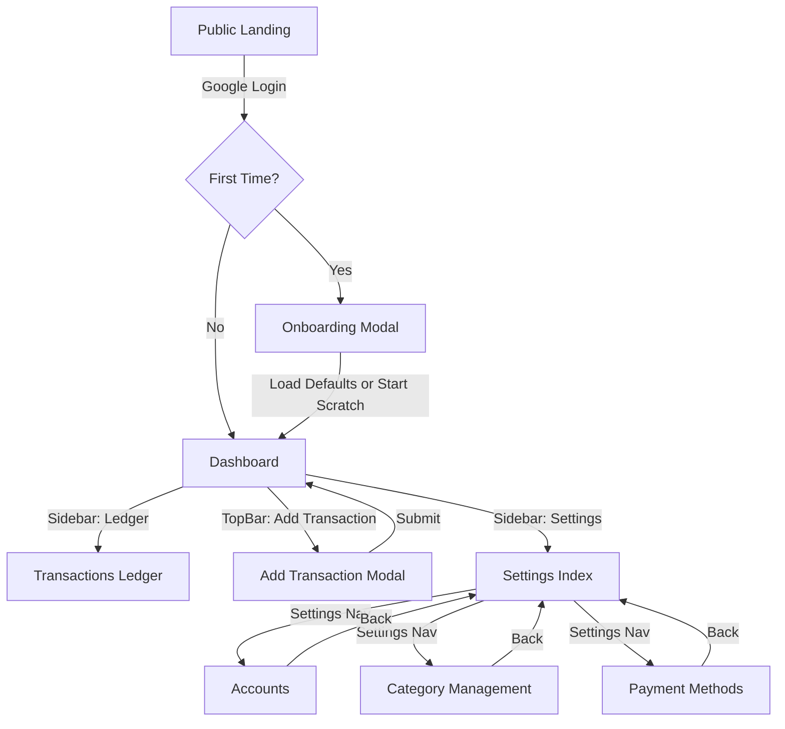

# UI Elements & User Flow

This document maps the visual architecture and interaction patterns of the **Moniq** application.

## 1. High-Level User Flow

---

## 2. Page-by-Page Breakdown

### 2.1 Dashboard (The Hub)
The first page seen after login. It provides a strategic view of financial health.
- **Header**: App branding and logout accessibility.
- **Net Worth Card**: Aggregated balance of all active "Sources."
- **Summary Cards**:
    - **Monthly Income**: Rolling 30-day income.
    - **Monthly Expenses**: Rolling 30-day spending.
    - **Savings Rate**: Percentage of income retained.
- **Recent Transactions**: Scrollable list of the latest activity with quick-vibe icons.

### 2.2 Add Transaction (The Engine)
A dedicated, distraction-free environment for recording activity.
- **Mode Selector (Tabs)**:
    - **Expense**: Standard spending.
    - **Income**: Revenue/Incoming funds.
    - **Transfer**: Non-spending movement between accounts.
- **Primary Amount Field**: Large, center-aligned input for immediate focus.
- **Logic Toggles**:
    - **Split Toggle**: Expands the form to allow multi-category allocation.
- **Dropdowns**: Selection for `Account`, `Category`, and `Payment Method`.
- **Note Field**: Free-text entry for context.

### 2.3 Transactions Ledger (The History)
A tabular/list view of all historical data.
- **Filter Bar**: Dynamic filtering by Date, Category, and Source.
- **Total Ledger Stats**: Summary of the filtered subset.
- **Transaction Rows**: 
    - Displaying: Date, Category, Method, Amount, and Note.
    - Colored indicators: Green (Income/Transfer In) vs Red (Expense/Transfer Out).

### 2.4 Settings & Configuration (Setup)
The administrative layer for mapping the user's financial world.
- **Accounts**: CRUD management for where money lives (Banks, Wallets, Cash Stashes). Archive-first with safe permanent deletion.
- **Categories**: Multi-tier taxonomy (Group -> Head -> Sub-head) for spending classification.
- **Payment Methods**: Definitions for how money moves, with optional "Smart Binding" to default accounts. Auto-created when accounts are added.

---

## 3. Global Design System Components

### PageShell
Every page except Login is wrapped in a `PageShell`.
- **Sticky Header**: Blurs content behind it.
- **Title/Subtitle**: Standardized typography for context.
- **Back Button**: Integrated navigation for sub-settings.

### Navigation (Desktop Layout)
The application uses a fixed **Sidebar + TopBar** layout.
- **Sidebar (220px)**: Persistent left navigation with links to Dashboard, Ledger, Budget, Insights, and Settings.
- **TopBar (48px)**: Contains global search and the primary "Add Transaction" button.
- **Main Content**: Scrollable area with max-width constraint (1248px) centered.

### Onboarding Modal
Shown once for new users (empty accounts and `hasCompletedOnboarding` not set).
- Displays curated default accounts in editable input fields.
- Shows a summary of standard categories to be generated.
- Two actions: "Start with Configuration" (load & customize defaults) or "Start from Scratch" (blank slate).

### Design Tokens
- **Background**: Deep Zinc (#09090b).
- **Primary Accent**: Vibrant Purple (#863bff).
- **Success/Income**: Emerald Green.
- **Error/Expense/Destructive**: Vivid Red (#ef4444).
- **Typography**: Inter (UI) and JetBrains Mono (Financials).
